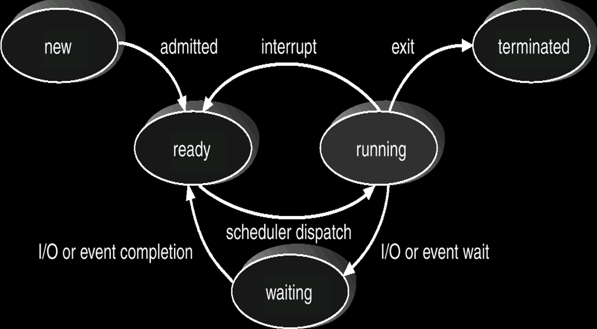
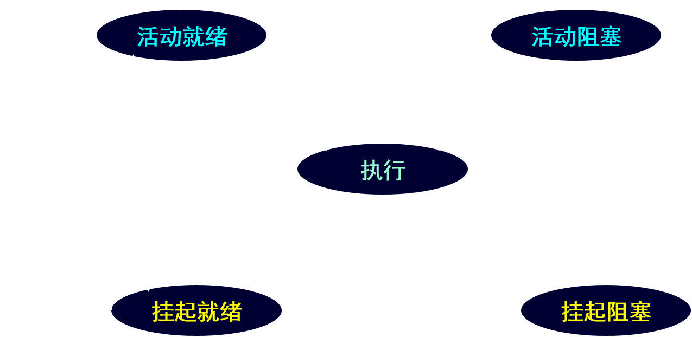

$2^{10}=1KB\\2^{20}=1MB$

# Chapter 1

$$
主要功能\begin{cases}处理机管理\\存储器管理\\设备管理\\文件管理\\用户接口功能
\end{cases}\\\ \\
基本特征\begin{cases}并发\\共享\\虚拟\\异步
\end{cases}\\\ \\
基本类型\begin{cases}批处理系统\\分时系统\\实时系统
\end{cases}
$$

# Chapter 2

PCB是进程存在的<font color="red">唯一标志</font>

$$
进程\begin{cases}
定义\begin{cases}是程序的一次执行\\是系统进行资源分配和调度的一个独立单位
\end{cases}\\结构\begin{cases}程序段\\相关数据段\\进程控制块(PCB)
\end{cases}\\特征\begin{cases}动态性\\并发性\\独立性\\异步性\end{cases}\\五种状态\begin{cases}
new\\terminated\\
ready\\running\\waiting\end{cases}
\end{cases}
$$

状态转换图



具有挂起状态的进程状态转换图



| 名称  | 原语        |
|:---:|:---------:|
| 创建  | create()  |
| 阻塞  | block()   |
| 唤醒  | wakup()   |
| 挂起  | suspend() |
| 激活  | active()  |

```cpp
//整型信号量, 只要S≤0，wait操作就不断的测试，未做到“让权等待”
wait(S){
    while(S <= 0);
    S--;
}
Signal(S){
    S++;
}


//记录型信号量，做到“让权等待”
//S初值为1，S为互斥信号量；S初值大于1，S为资源信号量
wait(S){
    S--;
    if (S < 0) block(S.L);
}
Signal(S){
    S++;
    if (S <= 0) wakeup(S.L);
}


//AND型信号量
Process A:{
    Wait(Dmutex);
    Wait(Emutex);
}
Process B:{
    Wait(Emutex);
    Wait(Dmutex);
}
```

```cpp
int full = 0, empty = n, mutex = 1;
//生产者进程
while(true){
    生产产品;
    P(empty);
    P(mutex);
    把产品送往Buffer;
    V(mutex);
    V(full);
}

//消费者进程
while(true){
    P(full);
    P(mutex);
    从Buffer取出产品l;
    V(mutex);
    V(empty);
    消费产品;
}
```

```cpp
//5个哲学家进餐问题
//第i个哲学家的进程
//最多允许4人同时进餐
while(true){
    wait(Sm); //Sm初值为4，表示同时进餐的哲学家最多为4人
    wait(stick[i]);
    wait(stick[(i + 1) % 5]);
    eat;
    signal(stick[i]);
    signal(stick[(i + 1) % 5]);
    signal(Sm);
    think;
}

//要么两手取筷子，要么不取，利用AND信号量机制
while(true){
    think;
    Swait(stick[(i + 1) % 5], stick[i]);
    eat;
    Ssignal(stick[(i + 1) % 5], stick[i]);
}
```

```cpp
//多读者，一写者
static int readcount = 0; //当前正在读数据集的读进程数目
int rmutex = 1, wmutex = 1;
void reader(){
    while(true){
        P(rmutex);
        if(readcount == 0) P(wmutex);
        readcount++;
        V(rmutex);
        读数据集;
        P(rmutex);
        readcount--;
        if(readcount == 0) V(wmutex);
        V(rmutex);
    }
}
void writer(){
    while(true){
        P(wmutex);
        写数据集;
        V(wmutex);
    }
}
```

# Chapter 3

$$
进程调度\begin{cases}
高级调度(长程/作业)\\
中级调度(中程/交换)\\
低级调度(短程/进程/CPU)
\end{cases}
$$

$$
产生死锁的必要条件\begin{cases}互斥条件\\请求和保持条件\\不剥夺条件\\循环等待条件
\end{cases}
$$

$$
处理死锁的基本方法\begin{cases}
预防死锁\begin{cases}破坏互斥条件(不可行)\\破坏请求和保持条件\\破坏不可剥夺条件\\破坏环路条件
\end{cases}
\\避免死锁：银行家算法\\检测死锁：资源分配图（无环路无死锁）\\解除死锁\begin{cases}
资源剥夺法\\撤销进程法\end{cases}
\end{cases}
$$

* 银行家算法 
  
  $$
  周转时间=结束时间-到达时间\\
带权周转时间=周转时间\div执行时间
  $$

# Chapter 4

$$
\begin{cases}编译：由编译程序将用户源程序编译成若干个目标模块\\链接：由链接程序将目标模块和相应的库函数链接装入模块\\
装入：由装入程序将装入模块装入内存
\end{cases}
$$

$$
程序的装入\begin{cases}绝对装入方式：只适用于单道程序环境\\可重定位装入方式\begin{cases}
静态重定位\\动态重定位\end{cases}\\动态运行时装入方式
\end{cases}
$$

$$
程序的链接\begin{cases}静态链接\\装入时动态链接\\运行时动态链接
\end{cases}
$$

$$
分区分配算法\begin{cases}首次适应\\循环首次适应\\最佳适应\\最坏适应\\快速适应
\end{cases}
$$

| 分区分配算法 | 内容                            | 特点                              |
| ------ | ----------------------------- | ------------------------------- |
| 首次适应   | 从空闲分区表/链首开始顺序查找               | 优先利用内存低地址的空闲分区，划分太碎增加了查找空闲分区的开销 |
| 循环首次适应 | 从上次找到的空闲分区下一个空闲分区开始查找         | 存储空间利用更均衡，但会缺乏大的空闲分区            |
| 最佳适应   | 空闲分区表/链递增排列，顺序查找              | 作业与分区一致时完美，稍大会留下许多难以利用的小空闲区     |
| 最坏适应   | 空闲分区表/链递减排列， 顺序查找             | 由于最大的空闲分区被首先划分，导致大作业没有足够的存储空间   |
| 快速适应   | 单独设立空闲分区表、管理索引表，指向该类型的空闲分区表表头 | 查找效率高，不会产生碎片。分区归还系统算法复杂         |

覆盖：把一个程序划分为一系列功能相对独立的程序段

交换：将暂时不用的某个进程及数据从内存移到外存中


$$
每页大小为2^{12}=4KB，地址空间最多有2^{20}=1M页\\ \ \\
逻辑地址空间中的地址为A，页面大小为L，则：\\页号P=int[\frac AL]\\页内地址W=[A]\mod L
$$

$$
有效访问内存的时间T=P_{TLB}\times(T_{TLB}+T_M)+(1-P_{TLB})\times(T_{TLB}+2T_M)\\
P_{TLB}为快表命中率，T_M为内存访问时间
$$

|        | 页式存储管理               | 段式存储管理                      |
|:------:|:--------------------:|:---------------------------:|
| 目的     | 实现非连续分配，解决碎片问题       | 更好满足用户需要                    |
| 信息单位   | 页（物理单位）              | 段（逻辑单位）                     |
| 大小     | 固定（由系统定）             | 不定（由用户程序定）                  |
| 内存分配单位 | 页                    | 段                           |
| 作业地址空间 | 一维                   | 二维                          |
| 优点     | 有效解决了碎片问题，有效提高内存的利用率 | 更好地实现数据共享与保护，段长可动态增长，便于动态链接 |

$$
虚拟存储器的特征\begin{cases}多次性：一个作业被分成多次调入内存\\对换性：允许在作业运行过程中换进、换出\\
虚拟性：能从逻辑上扩容，以多次性和对换性为基础
\end{cases}
$$

$$
分页中内存分配策略\begin{cases}最小物理块数的确定\\物理块的分配策略\begin{cases}
固定分配局部置换\\可变分配全局置换\\可变分配局部置换
0\end{cases}
\\物理块分配算法\begin{cases}
平均分配算法\\按比例分配算法\\考虑优先权的分配算法
\end{cases}
\end{cases}
$$

# Chapter 6

$$
I/O设备的类型\begin{cases}
使用方式/共享分类\begin{cases}独享设备\\共享设备\\虚拟设备
\end{cases}\\
传输速率\begin{cases}低速\\中速\\高速
\end{cases}\\信息交换单位\begin{cases}块设备\\字符设备
\end{cases}
\end{cases}
$$

$$
\begin{cases}数据信号线：双向（输入输出）\\控制信号线：控制器\rightarrow设备\\
状态信号线：设备\rightarrow控制器
\end{cases}
$$

$$
设备控制器的组成\begin{cases}
设备控制器与处理机的接口\\设备控制器与设备接口\\I/O逻辑
\end{cases}
$$

通道：一种特殊的执行I/O指令的<font color="red">处理机</font>，与CPU共享内存

解决“瓶颈”问题：<font color="red">多路方式</font>，增加设备到主机的通路而不增加通道

$$
通道\begin{cases}中断类型\begin{cases}数据传送结束中断\\故障中断
\end{cases}\\ \ \\类型\begin{cases}字节多路通道:低速设备\\
数组选择通道：高速通道\\数组多路通道：分时并行
\end{cases}
\end{cases}
$$

$$
设备独立性\begin{cases}概念：设备无关性\\\ \\
实现\begin{cases}易于实现I/O重定向\\执行所有设备的公有操作\\逻辑设备表LUT
\end{cases}
\end{cases}
$$

$$
常见的I/O控制方式\begin{cases}
程序I/O方式\\终端驱动I/O控制方式\\直接存储器访问DMA\\I/O通道控制方式
\end{cases}
$$

SPOOLING：将独占设备改造成为共享设备

$$
磁盘\begin{cases}
结构\begin{cases}磁道\\柱面\\扇区\\磁盘格式化\\
\end{cases}\\ \ \\
类型\begin{cases}
固定头磁盘\\移动头磁盘
\end{cases}\\ \ \\
访问时间\begin{cases}寻道时间\\旋转延迟时间\\传输时间
\end{cases}
\end{cases}
$$

$$
磁盘调度算法\begin{cases}
先来先服务FCFS\\最短寻道时间优先SSTF：选择从当前磁头位置时间最短的请求\\
扫描SCAN：磁头从一端开始移动，再反方向移动\\循环扫描CSCAN：磁头从一端开始单向·移动\\N-STEP-SCAN\\FSCAN
\end{cases}
$$

# Chapter 7

$$
文件类型\begin{cases}用途\begin{cases}系统文件\\用户文件\\库文件\end{cases}\\ \ \\
数据形式\begin{cases}源文件\\目标文件\\可执行文件\end{cases}\\ \ \\
存取控制属性\begin{cases}只读文件\\读写文件\\只执行文件\end{cases}\\ \ \\
组织形式和处理方式\begin{cases}普通文件\\目录文件\\特殊文件\end{cases}\\ \ \\
逻辑结构\begin{cases}记录式文件(有结构)\\流式文件(无结构)\end{cases}\\ \ \\
物理结构\begin{cases}顺序文件\\链接文件\\索引文件\end{cases}
\end{cases}
$$

# Chapter 8

$$
外存分配方法\begin{cases}
连续分配(顺序分配)\\链接分配\\索引分配
\end{cases}
$$

> 线上真香
> 
> 可惜PV居然没咋考
> 
> 2022.6.14
